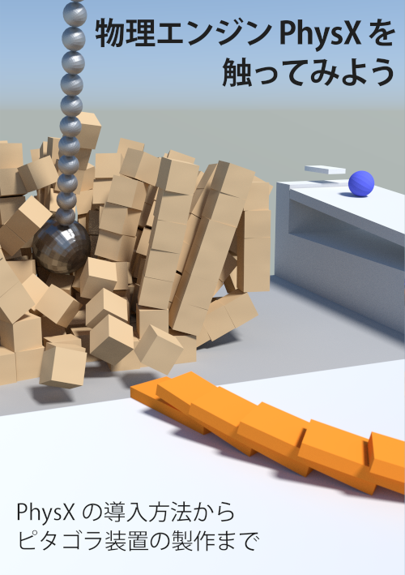
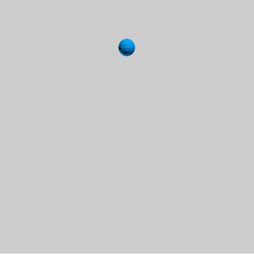
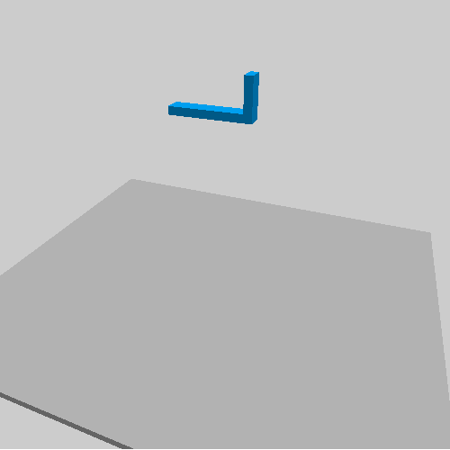
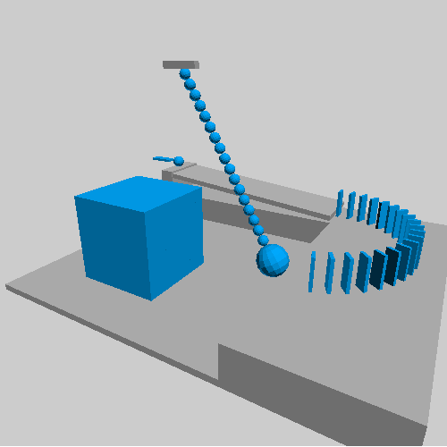

## 概要
2019年4月14日開催の技術書典6において頒布した"物理エンジンを触ってみよう"内に記載のサンプルプログラムを格納したリポジトリです。  
※PhysXの導入先はC:\PhysXとしています。変更する場合はVisual Studioでプロパティページを開き、インクルードディレクトリおよびライブラリディレクトリを変更するか、~.vcxprojファイルを直接編集してください。

  

### PhysXHelloWorld  

球が落下するようなプログラムです。

  

### PhysXJoint

ジョイントにより2つの剛体を接続し、落下により破壊するプログラムです。

  

### PhysXPitagora

簡単なピタゴラ装置のプログラムです。
STLファイル書き出し用のプログラムも含んでいます。
書き出したSTLファイルをBlenderなどで読み込むことで、表紙のような絵のレンダリングが可能となります。

  

